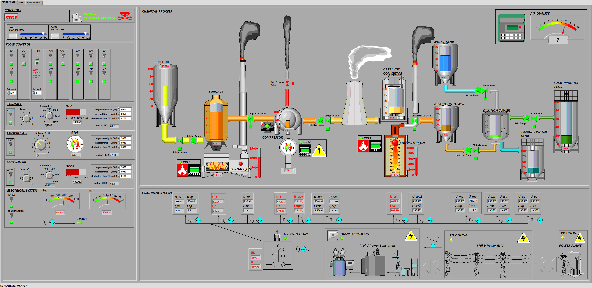
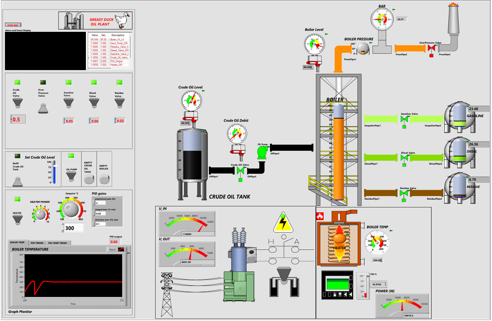
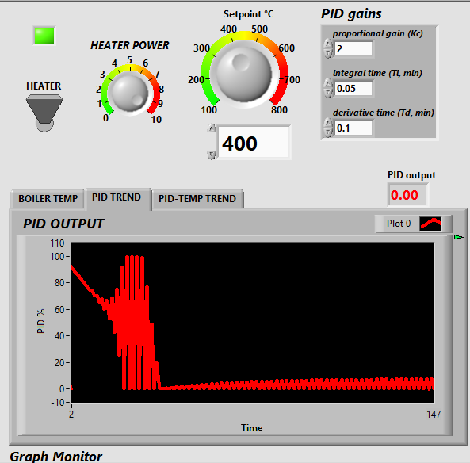
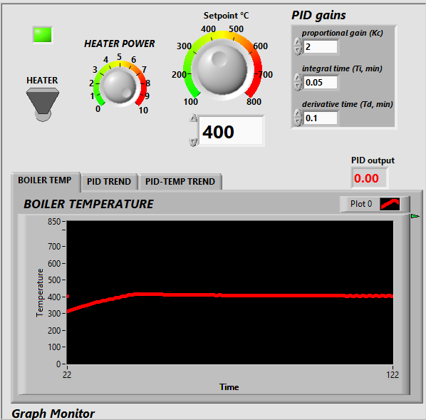

# LabVIEW Chemical Plant Simulator

Interactive real-time simulation of an industrial chemical plant (sulfuric acid production via contact process) built with **LabVIEW** and **DSC Module**.

The project models a classic heavy industrial facility with high power consumption, multiple tanks, pipes, pumps, valves, furnaces, compressors, catalytic converters, absorption & dilution towers, and realistic pollution/emissions.

### Features

- **Chemical process**: Sulfur burning → SO₂ → SO₃ → Oleum → Sulfuric acid
- **Valve and pump controls**: for inlet/outlet flow
- **Electrical chain**: 110 kV line → HV switch → transformer → 6 kV distribution → consumers
- **PID control** on furnace temperature and converter temperature
- **Pressure control** with PID and automatic overpressure safety valve
- **Air quality / emissions monitoring** (SO₂, NOx, particulate matter)
- **DSC alarms** (critical temperature, pressure, emissions, overflow, power overload)
- **Real-time & historical trends** (DSC Trend Controls)
- **Logging** to Citadel database (temperature, pressure, power, emissions)

### Screenshots

#### Main HMI Overview

---

# LabVIEW Oil Refinery Simulator

Interactive simulation of an atmospheric crude oil distillation refinery built in **LabVIEW** with the **DSC Module**.

### Features
- Crude oil storage tank with level control
- Boiler with heater, pressure, and temperature dynamics
- Pump and valves for inlet/outlet flow
- Fraction production: gasoline, diesel, residue (temperature-dependent)
- Realistic pressure calculation (temperature + level + outlet valves + safety valve)
- PID control for boiler temperature stabilization
- Electrical chain: 110 kV line → HV switch → transformer → 6 kV → heater
- DSC alarms (HI/HI_HI/LO/LO_LO + Rate of Change)
- Historical & real-time trends + alarm & event display
- Logging to Citadel database

### Screenshots

#### Main HMI

#### PID & Temperature Stabilization
| PID Stabilization (Output vs Temperature) | Temperature Stabilization (Setpoint Tracking) |
|-------------------------------------------|-----------------------------------------------|
|  |  |
